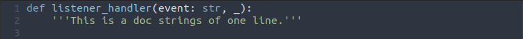

# Custom style guide - Python

Guia de estilos criado para deixar time alinhado com padrão de codificação de uma
determinada organização ou empresa.

Obs: Lembrando que este guia de estilos segue a PEP8, porém não em sua totalidade.
Algumas coisas são customizadas pensando em beleza e performance do código.

1 - Cabeçalho de arquivos Python.

- Preencher seus dados nos pontos necessários do cabeçalho.

- Realizar os `imports` sempre do menor para o maior.

- Delimitar o que é módulo externo e interno com comentários.

- Usar duas quebras de linhas entre o `copyright` e o início dos `imports`.

- Usar duas quebras de linhas entre o fim dos `imports` e o início do `código`.

- Ordem dos `imports` é primeiro os `imports externos` depois os `internos`.

- Se for você que escreveu o arquivo todo, é necessário colocar `Written` no copyright, se for você que corrigiu/refatorou o arquivo, é `Refactoring`.

Exemplo:

2 - Passagem de parâmetros para funções.

- Ao passar mais de dois parâmetros para uma função, deve-se seguir o padrão abaixo para que o código fique legível e a linha não fique muito grande e nem haja quebra de linhas desnecessárias.
- Caso haja até parâmetros não há necessidade de desempacotar, apenas adote o segundo exemplo.

Exemplo:

Obs: Os nomes das `keys` do dicionário devem ser os mesmos nomes e devem seguir as mesmas ordens dos parâmetros que a função/classe espera.

3 - Doc strings.

- As doc strings devem ser semanticamente corretas, ou seja, ter primeira letra maiúscula e ponto final ao fim da frase/texto.

- Se for um texto de mais de uma linha, deve se colocar a abertura da doc string no início, realizar a quebra de linha, descrever o texto, colocar ponto final e fechar logo abaixo. Caso seja em uma linha, apenas colocar a abertura e fechamento na mesma linha.

- Usar aspas simples para doc strings.

- Padrão de doc string é inglês.

- Manter uma quebra de linha entre o fim da doc string e o início do bloco de código da função.

Exemplo:

4 - Resposta de muitos parâmetros em dicionários.

- Para resposta de muitos parâmetros em dicionários, seguir o padrão abaixo para uma melhor visibilidade e entendimento do que se tem que retornar.

Exemplo:

5 - Utilização de aspas.

- O padrão que todos devem seguir para strings é de aspas simples.

- Único caso que se deve usar aspas duplas, é quando há a necessidade de passar aspas simples dentro da mesma string.

Exemplo:

6 - Acessar chave de dicionários.

- Para acessar chaves de dicionário, é mais usual utilizar a função `get`, pois a mesma aceita um segundo parâmetro que é acionado caso a chave não exista no dicionário.

Exemplo:

7 - Declaração de listas.

- A declaração de listas devem ser semelhantes à `passagem de parâmetros`, pois quanto mais evitarmos grandes blocos de chaves ou colchetes, mais limpo e declarativo, fica o código.

- A declaração de listas devem ser feitas com o objeto literal e não com a função.

Exemplo:

8. Declaração de dicionários.

- A declaração de dicionários devem ser semelhantes à passagem de parâmetros, pois quanto mais evitarmos grandes blocos de chaves ou colchetes, mais limpo e declarativo, fica o código.

- A declaração de dicionários devem ser feitas com o objeto literal e não com a função.

Exemplo:

9 - Strings longas com/sem interpolação.

- Neste caso é necessário utilizar doc string para declaração de textos longos com ou sem interpolação dentro do código.

Exemplo:

10 -  Declaração de classes.

- Sempre manter uma quebra de linha entre declaração da classe e início do código.

- Não há necessidade de haver doc strings para classes, apenas para funções, a menos que realmente haja necessidade de haver uma explicação na classe.

Exemplo:

11 - Convenção de nomes para variáveis booleanas.

- Por convenção todas as variáveis que são booleanas possuem um `is_` na frente de seu nome real.

Exemplo:

12 - Regra para quebras de linhas.

- É simples: Ou quebra tudo, ou não quebra nada. O que quero dizer com isso? Enquanto a linha estiver antes de 120 caracteres, deve-se manter o código em apenas uma linha, caso exceda 120 caracteres, é necessário que haja a quebra total do código.

Exemplo:

